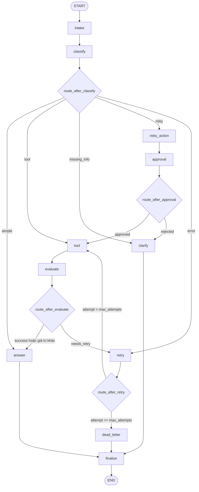

## Mở repo và xác định phần học viên phải sửa

Bản đồ Lab

### Đọc trước khi bắt đầu

240 phút Trung cấp

Xây dựng một support-ticket agent bằng LangGraph với typed state, conditional routing, bounded retry, human approval, persistence và metrics có thể kiểm toán.

#### Bài này đang nói về điều gì?

LangGraph hữu ích khi workflow cần state, vòng lặp, nhánh điều kiện, human approval và khả năng resume thay vì chỉ một chuỗi prompt tuyến tính.

Một graph production cần termination, audit event, retry bound, approval gate và metrics; output đẹp nhưng không truy vết được chưa đủ.

1. Typed state và reducers

2. LLM classification

3. Conditional routing

4. Tool và evaluation

5. Bounded retry

6. HITL approval

7. Persistence và metrics

#### Buổi Lab diễn ra như thế nào?

1. 0:00–0:20 Mỗi người
   ##### Setup và baseline
   Tạo môi trường, cài provider, cấu hình secret an toàn và xác nhận các test đang fail đúng tại TODO.

2. 0:20–1:30 Mỗi người
   ##### State và node contract
   Hoàn thiện state fields, reducers và các node classify, tool, evaluate, answer, clarify, risky action, approval, retry, dead letter và finalize.

3. 1:30–2:30 Mỗi người
   ##### Routing và graph wiring
   Cài bốn routing function, đăng ký mười một node, nối fixed/conditional edges và bảo đảm mọi route kết thúc.

4. 2:30–3:00 Mỗi người
   ##### Persistence và recovery
   Gắn checkpointer, thread_id và thu evidence về state history, SQLite hoặc crash-resume.

5. 3:00–4:00 Mỗi người
   ##### Scenarios, metrics và report
   Chạy sample scenarios, validate metrics, phân tích failure mode và hoàn thiện lab report.

#### Kết thúc bài, bạn có gì?

- Một graph xử lý đúng simple, tool, missing-info, risky và error route trên cả sample lẫn unseen scenarios.

- Một bộ evidence gồm metrics.json, lab report, persistence/recovery proof và giải thích ít nhất một route cùng một failure mode.

Chưa cần lo

Repo đã cung cấp state model, scenario loader, metrics schema, CLI và test contract. Hãy hoàn thiện từng node và route theo checkpoint; không cần giải toàn bộ graph trong một lần.

**Chuẩn bị trước (5 hướng dẫn)**

- [Hướng dẫn cài đặt Visual Studio Code và Git cho người mới](https://codelabs.vlearn.dev/tips/huong-dan-cai-vs-code-va-git?fromLab=day-23-track-3-langgraph-agentic-orchestration) Cài VS Code và Git, rồi kiểm tra cả hai công cụ đã sẵn sàng cho bài học tiếp theo.

- [Hướng dẫn cài Python và cấu hình Python trong VS Code](https://codelabs.vlearn.dev/tips/huong-dan-cai-python-va-cau-hinh-python-trong-vs-code?fromLab=day-23-track-3-langgraph-agentic-orchestration) Cài Python 3.13, chọn đúng interpreter và chạy hello.py trong VS Code.

- [Thiết lập môi trường ảo Python với pip hoặc uv](https://codelabs.vlearn.dev/tips/thiet-lap-venv-voi-pip-va-uv?fromLab=day-23-track-3-langgraph-agentic-orchestration) Tạo môi trường ảo và chọn đúng luồng pip hoặc uv để cài dependency cho một project Python.

- [Lấy API key để dùng AI: Gemini, OpenAI và Groq](https://codelabs.vlearn.dev/tips/api-key-cho-nguoi-moi-gemini-openai-groq-cap-nhat-2?fromLab=day-23-track-3-langgraph-agentic-orchestration) Tạo và lưu API key an toàn để sẵn sàng dùng AI trong dự án đầu tiên.

- [Hướng dẫn tải bài lab](https://codelabs.vlearn.dev/tips/huong-dan-tai-bai-lab?fromLab=day-23-track-3-langgraph-agentic-orchestration) Fork repo bài lab, clone về máy, rồi nộp link bài làm và kiểm tra lịch sử nộp trên AI Codelabs.

Mở [repo Day 8 — LangGraph Agentic Orchestration](https://github.com/VinUni-AI20k/phase2-k3-4-track3-day8-langgraph-agent), fork nếu giảng viên yêu cầu, rồi clone về máy. Đây là starter skeleton: state model, scenario loader, CLI, metrics schema và test contract đã có; phần orchestration chính còn để học viên hoàn thiện.

```bash
git clone https://github.com/VinUni-AI20k/phase2-k3-4-track3-day8-langgraph-agent
cd phase2-k3-4-track3-day8-langgraph-agent
git status
rg -n "TODO\(student\)|NotImplementedError" src tests docs README.md
```

Đọc song song các file sau trước khi sửa:

| Khu vực | Vai trò trong lab | Hành động của học viên |
| --- | --- | --- |
| [`src/langgraph_agent_lab/state.py`](https://codelabs.vlearn.dev/codelab/src/langgraph_agent_lab/state.py) | `Route`, `AgentState`, `Scenario`, initial state và audit event | Bổ sung các field còn thiếu; kiểm tra reducer và tính serializable. |
| [`src/langgraph_agent_lab/nodes.py`](https://codelabs.vlearn.dev/codelab/src/langgraph_agent_lab/nodes.py) | Một node mẫu và mười node `TODO(student)` | Implement node theo partial-update contract, không mutate input state. |
| [`src/langgraph_agent_lab/routing.py`](https://codelabs.vlearn.dev/codelab/src/langgraph_agent_lab/routing.py) | Bốn conditional routing function | Implement đúng decision table và node name. |
| [`src/langgraph_agent_lab/graph.py`](https://codelabs.vlearn.dev/codelab/src/langgraph_agent_lab/graph.py) | StateGraph builder | Đăng ký mười một node, nối fixed/conditional edges và compile với checkpointer. |
| [`src/langgraph_agent_lab/llm.py`](https://codelabs.vlearn.dev/codelab/src/langgraph_agent_lab/llm.py) | Factory chọn Gemini, OpenAI hoặc Anthropic | Dùng lại factory; bảo đảm biến môi trường thực sự được nạp. |
| [`src/langgraph_agent_lab/persistence.py`](https://codelabs.vlearn.dev/codelab/src/langgraph_agent_lab/persistence.py) | Memory checkpointer và extension durable storage | Dùng memory cho core; bổ sung SQLite/Postgres nếu làm extension. |
| [`src/langgraph_agent_lab/metrics.py`](https://codelabs.vlearn.dev/codelab/src/langgraph_agent_lab/metrics.py) | Schema và phép tổng hợp metrics | Hiểu metric nào đã đo thật, metric nào còn cần instrument. |
| [`src/langgraph_agent_lab/report.py`](https://codelabs.vlearn.dev/codelab/src/langgraph_agent_lab/report.py) | Renderer cho báo cáo Markdown | Implement trước khi chạy toàn bộ scenario command. |
| [`tests/`](https://codelabs.vlearn.dev/codelab/tests) | Public contract cho state, routing và graph smoke | Đọc và chạy; không sửa test để che lỗi implementation. |
| [`data/sample/scenarios.jsonl`](https://codelabs.vlearn.dev/codelab/data/sample/scenarios.jsonl) | Bảy scenario công khai để luyện tập | Dùng để kiểm tra coverage, không biến thành lookup table. |

[`configs/grading.yaml`](https://codelabs.vlearn.dev/codelab/configs/grading.yaml) trỏ tới hidden grading data không được phân phối. Không chạy config này, không tìm, không tạo lại và không thêm bất kỳ `data/grading/` nào vào bài nộp. Hidden scenarios sẽ kiểm tra khả năng tổng quát hóa ngoài bảy câu mẫu.

Kết quả mong đợi: bạn biết chính xác scaffold nào là contract, phần nào cần implementation và không sửa test, sample hay grading boundary để làm kết quả trông đúng.

---

## Hiểu target graph và rubric

Agent nhận một support ticket, chuẩn hóa query, dùng LLM phân loại intent rồi đi qua đúng nhánh. `route_after_classify`, `route_after_evaluate`, `route_after_retry` và `route_after_approval` là các hàm quyết định cạnh tiếp theo, không phải bốn node bổ sung.



Năm route đầu vào là `simple`, `tool`, `missing_info`, `risky` và `error`. Enum còn có `dead_letter` và `done` để biểu diễn outcome terminal. Mọi path phải ghé `finalize` trước `END`; giới hạn retry phải nằm trong logic `attempt < max_attempts`, không dựa vào recursion limit để chữa một graph nối sai.

Khi query có nhiều tín hiệu, prompt phân loại phải áp dụng đúng ưu tiên từ repo:

```text
risky > tool > missing_info > error > simple
```

Ví dụ, yêu cầu vừa tra cứu vừa hoàn tiền vẫn là `risky`, vì side effect cần approval quan trọng hơn lookup. Không đưa scenario ID vào prompt và không dùng exact query làm điều kiện.

Rubric phân bổ 100 điểm như sau:

| Hạng mục | Điểm | Evidence chính |
| --- | --- | --- |
| Architecture và state schema | 15 | Typed state, reducer đúng, field bổ sung hợp lý, node boundary rõ. |
| Graph construction và wiring | 15 | Đủ node/cạnh, conditional edge đúng, graph compile và chạy. |
| LLM integration | 15 | Structured-output classifier và grounded answer bằng LLM thật. |
| Graph behavior | 20 | Đúng route, retry hữu hạn, approval gate và termination. |
| Persistence và recovery | 10 | Checkpointer, `thread_id`, state history hoặc crash-resume evidence. |
| Metrics và tests | 15 | Metrics hợp lệ và có nghĩa, scenario coverage, test pass. |
| Report và demo | 10 | Kiến trúc, bảng kết quả, failure analysis và improvement plan. |

Một output nghe hợp lý nhưng không có event trail, termination proof hoặc persistence evidence vẫn chưa đạt contract production-style của lab.

Kết quả mong đợi: bạn có một sơ đồ duy nhất để đối chiếu khi wiring và biết mỗi quyết định kỹ thuật sẽ được chứng minh ở hạng mục rubric nào.

---

## Tạo môi trường đa nền tảng

Repo yêu cầu Python `3.11+`. Trên macOS/Linux, chạy:

```bash
python3 --version
python3 -m venv .venv
source .venv/bin/activate
python -m pip install -e ".[dev,openai]"
cp .env.example .env
```

Trên Windows PowerShell, chạy:

```powershell
python --version
python -m venv .venv
.venv\Scripts\Activate.ps1
python -m pip install -e ".[dev,openai]"
Copy-Item .env.example .env
```

Hai block trên dùng OpenAI làm ví dụ. Nếu chọn Gemini hoặc Anthropic, thay extra `openai` bằng extra tương ứng ở section kế tiếp; không cần cài cả ba provider. Sau khi activate, kiểm tra Python đang chạy từ virtual environment:

```powershell
python -c "import sys; print(sys.executable)"
python -c "import langgraph, pydantic; print('core imports: ok')"
```

Nếu lệnh đầu không trỏ vào `.venv`, dừng và activate lại trước khi cài package. Không dùng một interpreter để cài rồi một interpreter khác để chạy test.

Kết quả mong đợi: Python 3.11+ và project editable install hoạt động trong `.venv`, còn provider package khớp với lựa chọn của bạn.

---

## Chọn đúng một LLM provider

Chọn một provider chính cho toàn bộ lab:

```powershell
python -m pip install -e ".[dev,google]"
python -m pip install -e ".[dev,openai]"
python -m pip install -e ".[dev,anthropic]"
```

Ba dòng trên là ba lựa chọn độc lập, không phải ba bước liên tiếp. Chỉ chạy một dòng.

| Provider | Extra | Biến bắt buộc | Model mặc định trong `get_llm()` |
| --- | --- | --- | --- |
| Gemini | `google` | `GEMINI_API_KEY` | `gemini-2.5-flash` |
| OpenAI | `openai` | `OPENAI_API_KEY` | `gpt-4o-mini` |
| Anthropic | `anthropic` | `ANTHROPIC_API_KEY` | `claude-sonnet-4-20250514` |

`LLM_MODEL` có thể override model mặc định. Hãy chọn model hỗ trợ pattern structured output mà implementation của bạn sử dụng. Classifier và answer nên dùng cùng factory để việc chuyển provider không làm thay đổi graph contract.

Nếu có nhiều key cùng tồn tại, [`get_llm()`](https://codelabs.vlearn.dev/codelab/src/langgraph_agent_lab/llm.py) chọn theo thứ tự cố định:

1. Gemini.

2. OpenAI.

3. Anthropic.

Vì vậy, “đã cài OpenAI” không đồng nghĩa OpenAI đang được dùng nếu process còn nhìn thấy `GEMINI_API_KEY`. Cách ít gây nhầm nhất là chỉ expose key của provider đã chọn.

Kết quả mong đợi: bạn có đúng một provider package, biết model nào sẽ chạy và không vô tình gửi request sang provider có độ ưu tiên cao hơn.

---

## Cấu hình secret và nạp .env vào process

Có một khoảng trống quan trọng trong starter. [`llm.py`](https://codelabs.vlearn.dev/codelab/src/langgraph_agent_lab/llm.py) gọi `os.getenv()`, nhưng [`pyproject.toml`](https://codelabs.vlearn.dev/codelab/pyproject.toml) chưa khai báo `python-dotenv` và không entrypoint nào gọi `load_dotenv()`. Vì vậy:

```bash
cp .env.example .env
```

chỉ tạo file; nó **không bảo đảm** các biến trong file xuất hiện trong Python process.

Chọn một trong hai cách hợp lệ:

### Nạp file bằng python-dotenv

Thêm `python-dotenv` vào dependency phù hợp của project, rồi gọi đúng một lần trước khi factory đọc biến môi trường, chẳng hạn tại CLI entrypoint hoặc graph/LLM factory:

```python
from dotenv import load_dotenv

load_dotenv()
```

Không gọi lại trong từng node. Sau đó giữ `.env` ở local; file này đã được `.gitignore` loại trừ.

### Inject secret vào process

Đặt biến bằng shell profile an toàn, cấu hình Run/Debug của IDE, CI secret hoặc secret manager. Cách này không cần `python-dotenv`; điều kiện là process chạy pytest/CLI phải thật sự nhận được biến.

Kiểm tra tên provider được chọn mà không in giá trị secret và không gọi API:

```powershell
python -c "import os; keys=('GEMINI_API_KEY','OPENAI_API_KEY','ANTHROPIC_API_KEY'); print(next((k for k in keys if os.getenv(k)), 'NONE'))"
```

Nếu kết quả là `NONE`, `.env` chưa được load hoặc secret chưa được inject. Nếu kết quả khác provider dự kiến, bỏ key không dùng khỏi process trước khi chạy live.

Không đặt API key thật trong command được lưu history, source, test fixture, ảnh chụp, report, output JSON hoặc Git history. Dòng `CHECKPOINTER=memory` trong `.env.example` cũng chưa tự điều khiển CLI: CLI hiện đọc `checkpointer` từ YAML config. Chỉ tuyên bố một biến cấu hình hoạt động sau khi bạn đã nối code đọc nó hoặc đặt giá trị ở đúng nguồn CLI đang dùng.

Kết quả mong đợi: phép kiểm tra an toàn in đúng tên key của provider đã chọn, không in secret và bạn giải thích được vì sao chỉ copy `.env` là chưa đủ.

---

## Chạy baseline tests và phân loại expected failure

Chạy từng nhóm riêng để không nhầm lỗi scaffold với lỗi môi trường:

```powershell
python -m pytest tests/test_state.py tests/test_metrics.py -q
python -m pytest tests/test_routing.py -q
python -m pytest tests/test_graph_smoke.py -q
```

Đọc baseline theo bảng sau:

| Nhóm | Trạng thái hợp lý trước implementation | Cách diễn giải |
| --- | --- | --- |
| State và metrics | Có thể pass ngay | Starter đã có initial state, schema metrics và phép tổng hợp cơ bản. |
| Routing | Fail tại `NotImplementedError` | Đây là expected failure của bốn routing function, không phải lý do sửa test. |
| Graph smoke | Skip nếu thiếu API key; nếu đủ dependency/key thì còn fail tại TODO | Test cần LangGraph, đúng provider package và API key vì classifier/answer phải gọi LLM. |

Không báo “toàn bộ test suite phải xanh” ở baseline. Trước hết ghi lại test nào pass, fail, skip và nguyên nhân. Sau khi implementation hoàn tất, routing tests và graph smoke tests mới phải pass; lúc đó graph smoke có thể tạo request và chi phí thật.

Ba dấu hiệu lỗi môi trường cần xử lý trước khi viết logic:

- `ModuleNotFoundError` cho package core hoặc provider đã chọn.

- Python executable không nằm trong `.venv`.

- Key check trả `NONE` dù bạn đang chủ động chuẩn bị một live smoke test.

Kết quả mong đợi: baseline được phân loại thành pass, expected failure hoặc skip có lý do; bạn không sửa source/test chỉ để biến trạng thái baseline thành xanh giả.

---

## Thiết kế AgentState và reducers

[`AgentState`](https://codelabs.vlearn.dev/codelab/src/langgraph_agent_lab/state.py) là `TypedDict(total=False)`: node chỉ cần trả các field nó thay đổi. Hãy giữ state lean, serializable và đủ để routing, audit, metrics và recovery cùng đọc được.

Các field có sẵn:

| Field | Ý nghĩa | Cách cập nhật thường dùng |
| --- | --- | --- |
| `thread_id` | Khóa một execution thread cho checkpointer | Overwrite khi khởi tạo; giữ ổn định trong một run. |
| `scenario_id` | ID dùng cho metrics, không dùng để ra quyết định | Overwrite khi khởi tạo. |
| `query` | Support-ticket text đã normalize | Overwrite tại `intake`. |
| `route` | Route phân loại ban đầu | Overwrite tại `classify`; giữ nguyên qua các node sau. |
| `risk_level` | Mức rủi ro phục vụ audit/prompt | Overwrite tại `classify`. |
| `attempt` | Số lần đã đi qua retry node | Overwrite bằng số mới tại `retry`. |
| `max_attempts` | Retry bound của run | Overwrite khi khởi tạo; không tăng trong loop. |
| `final_answer` | Output cuối cho answer, clarification hoặc dead letter | Overwrite. |
| `messages` | Dấu vết hội thoại/tóm tắt xử lý | Append-only list với reducer `add`. |
| `tool_results` | Kết quả tool theo thứ tự thời gian | Append-only list với reducer `add`. |
| `errors` | Lỗi/failure note theo thứ tự thời gian | Append-only list với reducer `add`. |
| `events` | Audit event chuẩn hóa của từng node | Append-only list với reducer `add`. |

Bốn field học viên cần cân nhắc thêm:

| Field | Consumer | Cách cập nhật hợp lý |
| --- | --- | --- |
| `evaluation_result` | `route_after_evaluate` | Overwrite bằng `success` hoặc `needs_retry`. |
| `pending_question` | Clarification output và success metric | Overwrite bằng câu hỏi hiện tại. |
| `proposed_action` | Approval node và report/audit | Overwrite bằng action đang chờ duyệt. |
| `approval` | `route_after_approval`, answer và metrics | Overwrite bằng plain serializable mapping theo `ApprovalDecision`. |

Reducer `add` chỉ dành cho bốn list append-only. Các field scalar hoặc “giá trị hiện tại” như route, attempt, approval, evaluation result và final answer phải overwrite. Nếu node đọc `state["events"]`, `.append(...)` trực tiếp rồi trả lại cả list, bạn vừa mutate input vừa có nguy cơ nhân đôi dữ liệu khi reducer chạy.

Contract đúng là:

```text
đọc state hiện tại
→ tính giá trị mới trong local variables
→ trả partial update dict
→ để LangGraph reducer merge update vào state
```

Mỗi node nên trả `events: [make_event(...)]`. [`make_event()`](https://codelabs.vlearn.dev/codelab/src/langgraph_agent_lab/state.py) tạo cùng một shape gồm node, event type, message, latency và metadata, giúp metrics/report không phải đoán schema riêng của từng node.

`Route` có cả `dead_letter` và `done`, nhưng [`metric_from_state()`](https://codelabs.vlearn.dev/codelab/src/langgraph_agent_lab/metrics.py) đang coi `state["route"]` là **actual input route** để so với expected route. Vì vậy không overwrite `route` thành `done` trong `finalize`, cũng không đổi thành `dead_letter` chỉ vì workflow ghé node đó. Hãy biểu diễn completion bằng finalize event hoặc một field trạng thái riêng nếu thật sự cần, để không phá route metric.

Kết quả mong đợi: state có đủ bốn field bổ sung, bốn list dùng reducer append, scalar dùng overwrite và không node nào mutate object đầu vào.

---

## Implement các node theo dependency order

Repo có mười một node: `intake` đã là implementation mẫu và mười node còn lại là `TODO(student)`. Làm theo thứ tự sau để mỗi checkpoint chỉ phụ thuộc phần đã có:

1. Chốt state fields và reducer.

2. Implement `classify` để tạo route/risk.

3. Implement các nhánh không loop: `clarify`, `risky_action`, `approval`.

4. Implement chuỗi tool loop: `tool`, `evaluate`, `retry`, `dead_letter`.

5. Implement `answer` bằng LLM.

6. Implement `finalize` và kiểm tra audit trail.

Mỗi contract dưới đây nêu đúng phần cần đọc/ghi nhưng không cung cấp full solution.

### intake

- **Đọc:** raw `query`.

- **Ghi:** query đã `strip`, một message append và một event append.

- **Event:** `make_event("intake", "completed", ...)`, đã có trong starter.

- **Failure mode:** input rỗng khi graph bị gọi ngoài `Scenario` validator hoặc vô tình trả lại toàn bộ list cũ.

- **Checkpoint:** giữ node mẫu chạy qua `tests/test_state.py`; dùng nó làm chuẩn partial update cho các node khác.

### classify

- **Đọc:** `query`; không đọc `scenario_id` để quyết định route.

- **Ghi:** `route`, `risk_level`, event; khi LLM lỗi, ghi error/event hoặc dùng fallback có chủ đích và có thể audit.

- **Event:** route được chọn, risk level và trạng thái structured validation; không log secret hay toàn bộ sensitive prompt.

- **Failure mode:** keyword-only classifier, raw text parsing không validate, route ngoài enum hoặc không áp dụng priority.

- **Checkpoint:** năm route hợp lệ, `risky > tool > missing_info > error > simple`, unseen wording vẫn phân loại bằng LLM.

Pseudocode ngắn cho contract bắt buộc:

```text
định nghĩa schema với route thuộc năm giá trị cho phép
prompt := mô tả intent + priority + query, không có scenario ID
decision := get_llm().with_structured_output(schema).invoke(prompt)
validate decision
return partial update route + risk_level + event
```

`.with_structured_output()` hoặc contract tương đương là bắt buộc cho submission chính. Một fallback heuristic chỉ nên là failure-handling được log rõ; nó không thay thế đường LLM chính.

### tool

- **Đọc:** `route`, `attempt`, `query`; với risky route còn phải dựa trên action đã được approval.

- **Ghi:** append đúng một latest result vào `tool_results` và append event; có thể append error khi tool thật sự fail.

- **Event:** tool completed/failed, attempt hiện tại và metadata đủ để audit nhưng không chứa secret.

- **Failure mode:** thực thi risky side effect trước approval, hard-code scenario ID hoặc replace toàn bộ result history.

- **Checkpoint:** theo starter, `route == "error"` và `attempt < 2` sinh result chứa `ERROR`; các trường hợp khác sinh mock success có tính tổng quát.

### evaluate

- **Đọc:** phần tử mới nhất của `tool_results`.

- **Ghi:** overwrite `evaluation_result` thành `needs_retry` hoặc `success`, rồi append event.

- **Event:** verdict và lý do ngắn gọn.

- **Failure mode:** đọc nhầm result đầu tiên, retry khi không có bằng chứng lỗi hoặc để field không tồn tại.

- **Checkpoint:** heuristic nhận diện `ERROR` là đủ cho base score; LLM-as-judge là extension, không phải blocker của core.

### answer

- **Đọc:** `query`, các `tool_results` liên quan, `approval`/ `proposed_action` nếu có và context audit cần thiết.

- **Ghi:** overwrite `final_answer`, append event; ghi error/event nếu model call thất bại.

- **Event:** grounded generation completed/failed và provider/model metadata không nhạy cảm nếu cần.

- **Failure mode:** hard-code câu trả lời, bỏ qua tool result, tuyên bố action bị từ chối là đã thực hiện hoặc nuốt LLM exception.

- **Checkpoint:** answer được model sinh từ context thực tế, không từ scenario ID hay một mapping bảy câu mẫu.

Pseudocode định hướng:

```text
context := query + relevant tool results + approval/action context
prompt := chỉ trả lời dựa trên context; nói rõ giới hạn khi context thiếu
response := get_llm().invoke(prompt)
return final_answer + event
```

### clarify

- **Đọc:** `query`; trên nhánh rejected có thể đọc `approval.comment` và `proposed_action`.

- **Ghi:** overwrite `pending_question` và `final_answer` bằng một câu hỏi cụ thể, append event.

- **Event:** clarification requested cùng nguyên nhân missing info hoặc rejection.

- **Failure mode:** hỏi lại quá chung chung, để cả hai output rỗng hoặc vô tình tiếp tục gọi tool.

- **Checkpoint:** missing-info route và rejected approval đều kết thúc với câu hỏi có thể hành động rồi đi `finalize`.

### risky_action

- **Đọc:** `query`, `risk_level` và context cần để mô tả side effect.

- **Ghi:** overwrite `proposed_action`, append event.

- **Event:** action proposed và lý do cần review.

- **Failure mode:** thực thi tool/side effect ngay trong node hoặc tạo action không liên hệ query.

- **Checkpoint:** sau node này chưa có tool result mới; output chỉ là đề xuất chờ duyệt.

### approval

- **Đọc:** `proposed_action`.

- **Ghi:** overwrite `approval` bằng mapping có `approved`, `reviewer`, `comment`; append event.

- **Event:** approval observed cùng approved/rejected status.

- **Failure mode:** trả sai shape, thiếu decision, gọi tool trong approval node hoặc khiến CI chờ input vô hạn.

- **Checkpoint:** mặc định mock `approved=True` để test/CI không bị interactive block; real `interrupt()` chỉ làm ở extension.

### retry

- **Đọc:** `attempt`, `max_attempts`, latest failure/tool result.

- **Ghi:** overwrite `attempt` bằng giá trị cũ cộng đúng một, append một error và một event.

- **Event:** retry recorded, attempt mới và retry bound.

- **Failure mode:** tăng attempt ở cả tool lẫn retry, không tăng attempt, reset về 0 hoặc mutate `errors`.

- **Checkpoint:** routing dùng **giá trị sau increment** để quyết định `tool` hay `dead_letter`.

### dead_letter

- **Đọc:** `attempt`, `max_attempts`, `errors` và tool results cuối.

- **Ghi:** overwrite `final_answer` bằng thông báo không thể hoàn tất/escalate, append event.

- **Event:** exhausted/dead-letter với retry evidence.

- **Failure mode:** trả output rỗng, quay lại retry hoặc overwrite classified `route` làm metrics sai.

- **Checkpoint:** node chỉ có cạnh cố định tới `finalize`, không có cạnh trở lại tool.

### finalize

- **Đọc:** `final_answer` hoặc `pending_question` và audit state cần để xác nhận completion.

- **Ghi:** append duy nhất finalize event; không cần thay classified route.

- **Event:** `make_event("finalize", "completed", "workflow finished")` theo docstring.

- **Failure mode:** một branch bypass node, event bị lặp hoặc workflow kết thúc mà không có answer/question.

- **Checkpoint:** graph smoke tìm thấy ít nhất một event có `node == "finalize"` trên mọi route.

Với mọi LLM failure, chọn rõ một policy: fail có kiểm soát sang error/retry, hoặc fallback được đánh dấu trong `errors` và `events`. Không silently biến lỗi provider thành một câu trả lời “thành công”.

Kết quả mong đợi: cả mười một node có contract đọc/ghi rõ, event nhất quán, failure mode dự kiến và không node nào chứa full workflow hoặc hard-code sample scenario.

---

## Implement bốn routing function

Routing function chỉ đọc state và trả đúng tên node đã đăng ký. Không gọi LLM, không mutate state và không thực hiện side effect tại đây.

| Function | Điều kiện | Node tiếp theo |
| --- | --- | --- |
| `route_after_classify` | `simple` | `answer` |
| `route_after_classify` | `tool` | `tool` |
| `route_after_classify` | `missing_info` | `clarify` |
| `route_after_classify` | `risky` | `risky_action` |
| `route_after_classify` | `error` | `retry` |
| `route_after_classify` | unknown/missing | `answer` |
| `route_after_evaluate` | `evaluation_result == "needs_retry"` | `retry` |
| `route_after_evaluate` | mọi giá trị khác | `answer` |
| `route_after_retry` | `attempt < max_attempts` | `tool` |
| `route_after_retry` | `attempt >= max_attempts` | `dead_letter` |
| `route_after_approval` | `approval.approved is True` | `tool` |
| `route_after_approval` | false hoặc không được duyệt | `clarify` |

Pseudocode đủ để tự implement mà không chép full solution:

```text
route_after_classify := lookup route trong decision table, default answer
route_after_evaluate := retry chỉ khi verdict là needs_retry
route_after_retry := tool chỉ khi attempt còn nhỏ hơn max_attempts
route_after_approval := tool chỉ khi approved là true
```

Chạy checkpoint ngay sau khi hoàn thiện:

```powershell
python -m pytest tests/test_routing.py -q
```

Nếu test báo tên node khác nhau, sửa một phía theo contract public; đừng thêm alias tùy ý trong graph. Chú ý `route_after_approval` đang nhận approval dạng mapping trong public tests.

Kết quả mong đợi: toàn bộ routing tests pass, unknown route về `answer` và retry boundary đúng tại cả `<`, `==` lẫn `>` max attempts.

---

## Build và compile StateGraph

Đăng ký đúng mười một graph node. Tên graph node là contract mà routing function trả về:

| Tên đăng ký | Python function |
| --- | --- |
| `intake` | `intake_node` |
| `classify` | `classify_node` |
| `tool` | `tool_node` |
| `evaluate` | `evaluate_node` |
| `answer` | `answer_node` |
| `clarify` | `ask_clarification_node` |
| `risky_action` | `risky_action_node` |
| `approval` | `approval_node` |
| `retry` | `retry_or_fallback_node` |
| `dead_letter` | `dead_letter_node` |
| `finalize` | `finalize_node` |

Các fixed edge cần có:

| Từ | Đến |
| --- | --- |
| `START` | `intake` |
| `intake` | `classify` |
| `tool` | `evaluate` |
| `risky_action` | `approval` |
| `answer` | `finalize` |
| `clarify` | `finalize` |
| `dead_letter` | `finalize` |
| `finalize` | `END` |

Gắn conditional edge sau `classify`, `evaluate`, `retry` và `approval` bằng bốn routing function vừa test. Các destination trong path map phải khớp chính xác tên node ở bảng trên.

Pseudocode cấu trúc, không phải full implementation:

```text
builder := StateGraph(AgentState)
đăng ký 11 node
nối 8 fixed edge
nối 4 conditional edge theo decision table
compiled := builder.compile(checkpointer=checkpointer)
return compiled
```

Compile với chính argument `checkpointer` mà `build_graph()` nhận. Không tạo một checkpointer khác bên trong builder vì CLI cần quản lý lifecycle và backend từ config.

Sau khi graph đã nối và provider sẵn sàng, chạy:

```powershell
python -m pytest tests/test_graph_smoke.py -q
```

Lệnh này gọi LLM thật khi key có mặt. Kiểm tra quota/model trước, chạy một lần có chủ đích và không ghi prompt/output nhạy cảm vào repo.

Kết quả mong đợi: graph compile với checkpointer được truyền vào, có đủ mười một node và mọi output node cuối cùng đều nối tới `finalize → END`.

---

## Kiểm tra bounded retry và dead-letter

Retry loop chỉ hữu hạn khi ownership của counter rõ ràng: **chỉ retry node tăng `attempt`, mỗi lần đúng một**. Routing đọc counter sau update.

| State sau retry node | Quyết định | Ý nghĩa |
| --- | --- | --- |
| `attempt < max_attempts` | `tool` | Còn quyền thử lại. |
| `attempt == max_attempts` | `dead_letter` | Đã chạm giới hạn, không gọi tool thêm. |
| `attempt > max_attempts` | `dead_letter` | Fail closed nếu state bất thường. |

Error route bắt đầu tại `retry`, không đi thẳng vào tool. Với giá trị mặc định, trace khái niệm là:

```text
classify(error)
→ retry(increment)
→ tool
→ evaluate
→ retry(increment) nếu needs_retry
→ tool hoặc dead_letter
→ answer hoặc dead_letter
→ finalize
→ END
```

Scenario `S07_dead_letter` có `max_attempts=1`. Từ initial `attempt=0`, lần vào retry đầu tiên phải tạo `attempt=1`; điều kiện `1 >= 1` đưa thẳng tới `dead_letter`, rồi `finalize`. Nếu S07 gọi tool hoặc chạy vô hạn, counter/edge đang sai.

Chạy checkpoint nhỏ trước khi scenario runner:

```powershell
python -m pytest tests/test_routing.py -k retry -q
```

Sau đó quan sát event trail của error scenario và xác nhận:

- Mỗi event `retry` tương ứng đúng một lần counter tăng.

- `errors` giữ lịch sử theo reducer, không bị replace.

- Dead-letter có final answer giải thích/escalate.

- Sau dead-letter chỉ có finalize rồi END.

- Không cần nâng recursion limit để graph kết thúc.

Kết quả mong đợi: cả error route thường và S07 đều kết thúc hữu hạn; S07 đi qua dead-letter khi attempt vừa chạm max.

---

## Kiểm tra risky action và approval

Approval là gate trước side effect, không phải event ghi nhận sau khi tool đã chạy.

| Decision | Trace bắt buộc | Điều không được xảy ra |
| --- | --- | --- |
| Approved | `risky_action → approval → tool → evaluate → ... → finalize` | Tool chạy trước approval. |
| Rejected | `risky_action → approval → clarify → finalize` | Tool xuất hiện ở bất kỳ vị trí nào sau rejection. |

Default `approval_node` có thể trả mock approval để public test và CI không chờ người dùng. Mock vẫn phải có shape `approved`, `reviewer`, `comment` và event rõ ràng. Không coi mock approval là bằng chứng real interrupt/resume.

Chạy routing checkpoint:

```powershell
python -m pytest tests/test_routing.py -k approval -q
```

Tạo thêm unit test/local probe bằng state tổng quát, không dùng scenario ID, rồi kiểm tra thứ tự event:

```text
approved: index(approval) < index(tool)
rejected: approval và clarify tồn tại, tool không tồn tại
all cases: finalize là event terminal
```

Nếu dùng real `interrupt()` ngay trong core, test có thể treo hoặc cần resume command mà CI không cung cấp. Giữ mock làm default; real HITL interrupt/resume được tách thành extension sau phút 240.

Kết quả mong đợi: risky action chỉ được chuẩn bị trước review, approved mới tới tool, rejected tới clarification và cả hai nhánh đều finalize.

---

## Gắn checkpointer và thread_id

Luồng config hiện tại là:

```text
configs/lab.yaml
→ CLI đọc checkpointer
→ build_checkpointer(...)
→ build_graph(checkpointer=...)
→ graph.invoke(..., configurable.thread_id)
```

[`initial_state()`](https://codelabs.vlearn.dev/codelab/src/langgraph_agent_lab/state.py) đã tạo `thread_id`, còn [`cli.py`](https://codelabs.vlearn.dev/codelab/src/langgraph_agent_lab/cli.py) đã truyền nó theo shape LangGraph cần:

```python
{"configurable": {"thread_id": state["thread_id"]}}
```

Giữ cùng `thread_id` khi xem lại state của một run; dùng thread mới cho scenario khác để tránh checkpoint chồng lên nhau.

Ba mức persistence trong repo:

| Mức | Trạng thái | Evidence phù hợp |
| --- | --- | --- |
| Memory | Có sẵn, default trong `configs/lab.yaml` | Graph compile với `MemorySaver`, mỗi run có thread ID, đọc được latest state/state history trong cùng process. |
| SQLite | Extension thực tế | State/history còn tồn tại sau khi process kết thúc; có thể chứng minh crash-resume. |
| Postgres | Optional extension qua Docker Compose | Durable multi-process backend; cần lifecycle và secret/config rõ ràng. |

Rubric dành 10 điểm cho persistence/recovery. Evidence tối thiểu phải chứng minh checkpointer thật sự được truyền vào compiled graph và state history gắn với đúng thread. SQLite hoặc crash-resume là bằng chứng mạnh hơn memory vì memory mất khi process dừng. Postgres không bắt buộc cho core lab.

Khi làm SQLite extension, cài extra `sqlite`, dùng connection phù hợp với `SqliteSaver`, bật WAL theo hướng dẫn repo và không commit `checkpoints.db`. Khi làm Postgres, Docker Compose chỉ khởi động database; code adapter và việc truyền `database_url` vẫn là trách nhiệm của bạn.

`CHECKPOINTER` trong `.env.example` hiện không được CLI đọc. `configs/lab.yaml` mới là nguồn đang hoạt động. Tương tự, đừng tuyên bố recovery thành công chỉ vì database chạy; phải có state history hoặc một lần resume được ghi lại trong report.

Kết quả mong đợi: compiled graph dùng checkpointer thật, mỗi run có `thread_id` đúng và report có evidence state history hoặc recovery thay vì chỉ mô tả ý định.

---

## Chạy sample scenarios mà không hard-code

Bảy sample là coverage fixture, không phải bảng đáp án để nhúng vào classifier:

| Scenario | Expected route | Approval | Retry signal |
| --- | --- | --- | --- |
| `S01_simple` | `simple` | Không | Không |
| `S02_tool` | `tool` | Không | Không |
| `S03_missing` | `missing_info` | Không | Không |
| `S04_risky` | `risky` | Có | Không |
| `S05_error` | `error` | Không | Có |
| `S06_delete` | `risky` | Có | Không |
| `S07_dead_letter` | `error` | Không | Có, `max_attempts=1` |

Trước lần chạy full đầu tiên, bảo đảm [`render_report()`](https://codelabs.vlearn.dev/codelab/src/langgraph_agent_lab/report.py) không còn `NotImplementedError`: `run-scenarios` ghi metrics rồi gọi `write_report()`, nên command vẫn fail ở cuối nếu renderer chưa hoạt động.

Khi provider/key đã sẵn sàng và bạn chấp nhận live API usage, chạy sample config:

```powershell
make run-scenarios
```

Trên Windows không có Make, dùng:

```powershell
python -m langgraph_agent_lab.cli run-scenarios --config configs/lab.yaml --output outputs/metrics.json
```

Mỗi scenario đi qua LLM classifier và các route tới `answer` cũng dùng LLM grounded generation; vì vậy lệnh này có thể tạo nhiều request. Bắt đầu bằng graph smoke, kiểm tra model/quota, rồi mới chạy đủ bảy scenario.

Đánh giá theo behavior chứ không theo exact wording:

- Actual route khớp intent và priority.

- Output có `final_answer` hoặc `pending_question`.

- Risky scenario quan sát được approval trước tool.

- Error scenario có bounded retry/dead-letter phù hợp.

- Event trail kết thúc ở finalize.

Không chạy `configs/grading.yaml`. Hidden scenarios không có trong repo và không cần được tái tạo để hoàn thành lab.

Kết quả mong đợi: bảy sample chạy qua một implementation tổng quát, có event trail đúng và không có điều kiện theo exact query hoặc scenario ID.

---

## Sinh và kiểm tra outputs/metrics.json

[`MetricsReport`](https://codelabs.vlearn.dev/codelab/src/langgraph_agent_lab/metrics.py) yêu cầu bảy field cấp report:

| Field | Ý nghĩa |
| --- | --- |
| `total_scenarios` | Số scenario đã chạy; local validator yêu cầu ít nhất 6. |
| `success_rate` | Tỷ lệ route/output/approval contract đạt. |
| `avg_nodes_visited` | Trung bình số audit event được đếm như node visit. |
| `total_retries` | Tổng event có node `retry`. |
| `total_interrupts` | Tổng event có node `approval` theo implementation hiện tại. |
| `resume_success` | Bằng chứng resume/replay; helper hiện mặc định `False`. |
| `scenario_metrics` | Danh sách metric cho từng scenario. |

Mỗi scenario metric gồm:

- `scenario_id`.

- `expected_route` và `actual_route`.

- `success`.

- `nodes_visited`.

- `retry_count`.

- `interrupt_count`.

- `approval_required` và `approval_observed`.

- `latency_ms`.

- `errors`.

Hiểu đúng các giới hạn của scaffold trước khi diễn giải số:

- `metric_from_state()` hiện không nhận hoặc đo wall-clock latency, nên `latency_ms` giữ default `0`.

- `summarize_metrics()` luôn đặt `resume_success=False`, dù bạn đã dùng checkpointer.

- `interrupt_count` hiện đếm event có `node == "approval"`; mock approval visit vì thế có thể bị gọi là interrupt dù workflow chưa pause thật.

- `nodes_visited` là số event, nên node không log event sẽ biến mất khỏi metric; node log hai event có thể bị đếm hai lần.

- `approval_observed` chỉ kiểm tra approval object có tồn tại, không tự chứng minh tool chạy sau approval.

Nếu muốn metric có ý nghĩa production-quality, hãy instrument có chủ đích:

1. Đo `time.perf_counter()` quanh từng `graph.invoke` và đưa duration thật vào `ScenarioMetric`.

2. Giữ quy ước một completion event chính cho mỗi node hoặc tách rõ event count khỏi node count.

3. Chỉ đặt `resume_success=True` khi có evidence replay/resume kiểm chứng được.

4. Phân biệt approval-node visit, real interrupt và successful resume nếu bạn làm HITL extension.

Validate schema sau khi sinh file:

```powershell
make grade-local
```

Hoặc:

```powershell
python -m langgraph_agent_lab.cli validate-metrics --metrics outputs/metrics.json
```

Metrics parse đúng schema nhưng latency/retry/interrupt đều 0 không tự động là evidence tốt. Đối chiếu từng con số với event trail và giải thích trong report.

Kết quả mong đợi: `outputs/metrics.json` qua Pydantic validation, có ít nhất sáu scenario và các số liệu quan trọng phản ánh runtime/evidence thật chứ không chỉ giá trị mặc định.

---

## Hoàn thiện reports/lab_report.md

Dùng [`reports/lab_report_template.md`](https://codelabs.vlearn.dev/codelab/reports/lab_report_template.md) làm khung. Báo cáo cuối cần có:

| Phần | Nội dung cần chứng minh |
| --- | --- |
| Student | Tên, repo/commit và ngày; không có secret. |
| Architecture | Mười một node, fixed/conditional edges và termination. |
| State schema | Field nào append, field nào overwrite và lý do. |
| Scenario results | Số liệu lấy từ `outputs/metrics.json`, không chép bằng tay khác nguồn. |
| Failure analysis | Ít nhất hai failure mode, tín hiệu phát hiện, containment và residual risk. |
| Persistence/recovery | Thread ID, state history hoặc crash-resume evidence. |
| Extension work | Chỉ ghi phần đã chạy và có proof. |
| Improvement plan | Một ưu tiên productionize tiếp theo và lý do. |

Hai failure mode tối thiểu nên bao gồm các đường thật của graph, chẳng hạn tool failure dẫn tới bounded retry/dead-letter và risky action bị chặn/rejected trước tool. Phân tích phải trả lời: lỗi bắt đầu ở đâu, state/event nào giúp phát hiện, graph đi đâu tiếp, termination được bảo đảm thế nào và còn giới hạn gì.

`make run-scenarios` gọi `write_report()` với path từ `configs/lab.yaml`, nên có thể overwrite `reports/lab_report.md`. Hãy implement `render_report()` để sinh các bảng metric ổn định trước, rồi hoàn thiện phần phân tích/evidence sau lần scenario run cuối; nếu tiếp tục chạy lại, bảo đảm renderer giữ được nội dung cần nộp.

Không dùng screenshot chứa API key, environment dump, database credential hoặc raw secret. Khi trích event/history, chỉ giữ phần cần chứng minh route, retry, approval và recovery.

Checkpoint review:

- Số scenario và route trong report khớp JSON.

- Retry/interrupt/latency không được mô tả quá mức so với instrumentation thật.

- Có ít nhất hai failure mode cụ thể.

- Có một persistence/recovery proof, không chỉ câu “đã dùng MemorySaver”.

- Improvement plan phân biệt core đã làm và extension chưa làm.

Kết quả mong đợi: `reports/lab_report.md` là một lập luận có evidence nối từ architecture → state/events → metrics → failure/recovery, không phải bản chép lại schema.

---

## Chạy gate cuối và submission checklist

Trên macOS/Linux hoặc WSL, chạy theo thứ tự:

```bash
make lint
make typecheck
make test
make run-scenarios
make grade-local
git status
git diff --check
```

Trên Windows PowerShell, dùng các lệnh Python tương đương:

```powershell
python -m ruff check src tests
python -m mypy src
python -m pytest -q
python -m langgraph_agent_lab.cli run-scenarios --config configs/lab.yaml --output outputs/metrics.json
python -m langgraph_agent_lab.cli validate-metrics --metrics outputs/metrics.json
git status
git diff --check
```

`run-scenarios` và graph smoke dùng API thật khi key đã load; kiểm tra provider, quota và model trước gate. Lint/typecheck/routing/state/metrics tests không cần gọi API.

### Submission checklist

- State fields và reducers đúng.

- Mười node TODO đã được implement.

- Bốn routing function hoạt động.

- Graph có đủ mười một node.

- Classifier dùng LLM structured output.

- Answer dùng LLM và grounded context.

- Không hard-code sample scenarios.

- Retry hữu hạn và dead-letter hoạt động.

- Risky action đi qua approval.

- Rejected approval đi clarification.

- Mọi route đi qua finalize.

- Checkpointer và thread_id được sử dụng.

- Có persistence/recovery evidence.

- `outputs/metrics.json` hợp lệ và có số liệu có nghĩa.

- `reports/lab_report.md` đã hoàn thiện.

- Báo cáo phân tích ít nhất hai failure mode.

- Không có secret trong Git.

- Không có hidden grading data trong bài nộp.

- Lint, typecheck và tests pass theo gate cuối.

Đừng dùng việc sửa test, sample, config chấm hoặc report template để che một contract chưa đạt. `git status` phải giúp bạn giải thích được mọi file thay đổi; `git diff --check` phải sạch whitespace error.

Kết quả mong đợi: các gate core đều pass, output/report khớp nhau, bài nộp không chứa secret hay hidden data và bạn giải thích được ít nhất một route cùng hai failure mode.

---

## Extensions sau phút 240

Chỉ bắt đầu phần này sau khi core checklist đã đạt. Extensions là tùy chọn để hướng tới band điểm cao hơn; mỗi mục chỉ có giá trị khi kèm test hoặc evidence trong report.

- **LLM-as-judge:** thay heuristic evaluator bằng structured verdict có reason, timeout/fallback và cost guard.

- **Real HITL interrupt/resume:** dùng `interrupt()` cho approval, nhận decision từ reviewer và resume đúng `thread_id`; giữ mock làm default cho CI.

- **SQLite/Postgres recovery:** chứng minh checkpoint durable qua process restart; Postgres có thể dùng service trong Docker Compose.

- **Time travel:** đọc state history, chọn checkpoint cũ và replay/fork có kiểm soát.

- **Parallel fan-out bằng `Send()`:** chạy nhiều tool độc lập, thiết kế reducer để merge kết quả deterministically.

- **Streamlit UI:** hiển thị ticket, proposed action, approval/rejection và event trail mà không lộ secret.

- **Mermaid graph export:** xuất graph thực tế từ compiled graph rồi đối chiếu với target diagram.

Với mỗi extension, ghi rõ baseline, thay đổi, cách kiểm tra, evidence và giới hạn. Không đổi behavior core hoặc làm CI phụ thuộc service tương tác/online chỉ để có thêm tính năng.

Kết quả mong đợi: core 240 phút vẫn ổn định; extension được chọn có proof riêng, không làm mất bounded retry, approval gate, persistence contract hoặc termination.

#### Góp ý cho buổi Lab

Không bắt buộc và không ảnh hưởng việc nộp bài. Giảng viên chỉ xem phản hồi ẩn danh.

[Góp ý bài Lab](https://codelabs.vlearn.dev/feedback?subject=lab&lab=day-23-track-3-langgraph-agentic-orchestration)

#### Nộp bài và đánh giá Lab

Dán link GitHub, Drive hoặc LMS của bài đã nộp. Điểm và nhận xét sẽ không hiển thị tại đây.

Đang tải trạng thái bài nộp…
